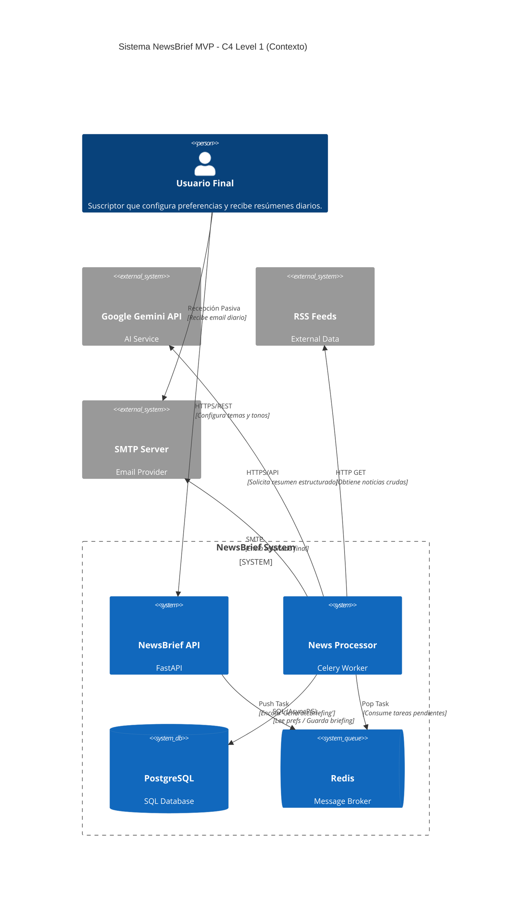

# newsbrief Architecture - C4 Level 1

## Descripción del Diagrama

### Actores
- **Usuario Final**: Persona que usa la API REST y recibe emails con los briefings

### Sistemas Internos (NewsBrief MVP)
- **API REST** (FastAPI): Expone endpoints para gestión de preferencias
- **Celery Worker**: Procesa tareas asíncronas de generación de briefings
- **PostgreSQL**: Almacena usuarios, preferencias y briefings
- **Redis**: Broker de mensajes y cache

### Sistemas Externos
- **Gemini API**: Servicio de IA para generar resúmenes
- **RSS Feeds**: Fuentes de noticias técnicas
- **Servidor SMTP**: Envío de emails

### Relaciones Principales
| De | A | Protocolo | Descripción |
|---|---|---|---|
| Usuario | NewsBrief API | HTTPS/REST | Configura temas, tonos y consulta historial |
| Usuario | SMTP Server | SMTP (Pasivo) | Recibe el email con el resumen diario |
| NewsBrief API | Redis | TCP/IP (Push) | Encola la tarea GenerateBriefing |
| Celery Worker | Redis | TCP/IP (Pop) | Consume tareas pendientes de la cola |
| Celery Worker | PostgreSQL | SQL (AsyncPG) | Lee preferencias y guarda el briefing generado |
| Celery Worker | RSS Feeds | HTTP GET | Obtiene las noticias crudas del día |
| Celery Worker | Google Gemini | HTTPS/API | Solicita el resumen estructurado con tono |
| Celery Worker | SMTP Server | SMTP | Envía el resultado final al usuario |