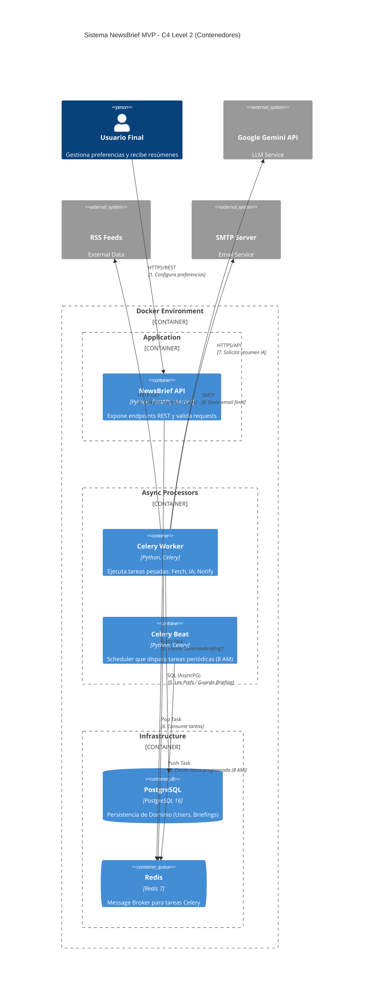

# NewsBrief MVP - C4 Level 2 (Containers)

## Descripción del Diagrama

### Contenedores Docker (Unidades Ejecutables)

| Contenedor | Tecnología | Descripción | Ejecuta Migraciones |
|------------|-------------|-------------|-------------------|
| NewsBrief API | Python, FastAPI, Uvicorn | Expide endpoints REST y valida requests | ✅ Alembic (entrypoint.sh) |
| Celery Worker | Python, Celery | Ejecuta tareas pesadas: Fetch, IA, Notify | ❌ |
| Celery Beat | Python, Celery | Scheduler que dispara tareas periódicas | ❌ |
| PostgreSQL | PostgreSQL 16 | Persistencia de Dominio | ❌ |
| Redis | Redis 7 | Message Broker para tareas Celery | ❌ |

### Sistemas Externos

| Sistema | Descripción |
|---------|-------------|
| Google Gemini API | Generación de resúmenes con tono (LLM) |
| RSS Feeds | Fuentes de noticias externas |
| SMTP Server | Envío de notificaciones por email |

## Flujo de Datos

| Paso | De | A | Protocolo | Descripción |
|-----|---|---|----------|-------------|
| 1 | Usuario | NewsBrief API | HTTPS/REST | Configura preferencias |
| 2 | NewsBrief API | Redis | Push Task | Encola 'GenerateBriefing' |
| 3 | Celery Beat | Redis | Push Task | Encola tarea programada (8 AM) |
| 4 | Celery Worker | Redis | Pop Task | Consume tareas pendientes |
| 5 | Celery Worker | PostgreSQL | SQL (AsyncPG) | Lee prefs / Guarda briefing |
| 6 | Celery Worker | RSS Feeds | HTTP GET | Obtiene noticias crudas |
| 7 | Celery Worker | Google Gemini | HTTPS/API | Solicita resumen IA |
| 8 | Celery Worker | SMTP Server | SMTP | Envía email final |

## Correcciones vs Versión Anterior

| Aspecto | Versión Anterior | Versión Corregida |
|---------|-----------------|-------------------|
| DI como contenedor | Dependency Injection separado | Eliminado (es patrón de código) |
| Handlers | Contenedor separado | Eliminado (vive dentro de API) |
| Adapters | Contenedores separados | Eliminado (viven dentro de Worker) |
| Flujo Redis | Handler → Worker → Redis | API → Redis → Worker (correcto) |
| Beat | No existía | Agregado al diagrama |

## Notas Técnicas

### Alembic en Docker
- **Las migraciones se ejecutan automáticamente** al iniciar el contenedor de la API mediante `entrypoint.sh`.
- El script espera a que PostgreSQL esté disponible (`wait-for-db`) y luego ejecuta `alembic upgrade head`.
- Una vez completadas las migraciones, inicia Uvicorn.
- Este enfoque garantiza que el esquema de base de datos está siempre actualizado sin intervención manual.

### Contenedores C4
- Contenedores C4 representan unidades ejecutables independientes (procesos Docker).
- Adapters (RSS Fetcher, Gemini Summarizer, Email Notifier) son clases Python dentro del proceso Worker.
- Celery Worker consume tareas desde Redis (message broker), no directamente de la API.
- Celery Beat publica tareas periódicas a la cola de Redis.
- El Worker actúa como orquestador interno: Strategy Pattern permite intercambiar fuentes de datos sin modificar el flujo principal.